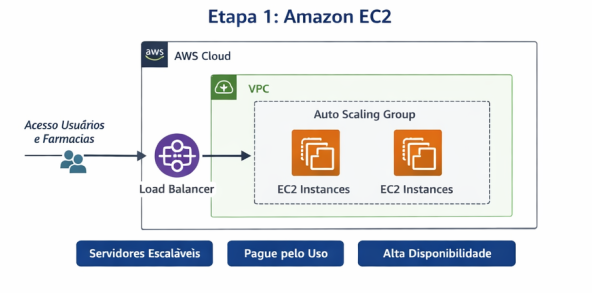
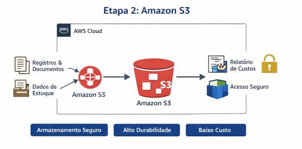
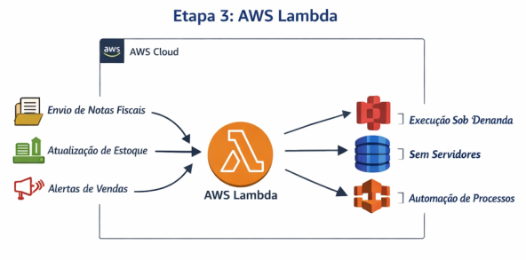

# 📋️ RELATÓRIO DE IMPLEMENTAÇÃO DE SERVIÇOS AWS

- **Data:** 13/02/2026
- **Empresa:** FarmaDistribuidora Ltda
- **Responsável:** Andreza Freitas
- **Área:** Cloud Computing / AWS
- **Objetivo:** Redução de Custos e Escalabilidade

## 🔹️Introdução

Este relatório detalha a implementação de serviços AWS na FarmaDistribuidora Ltda, com foco em redução de custos, escalabilidade e eficiência operacional. O objetivo é apresentar soluções em nuvem que permitam à empresa se tornar uma revendedora moderna, conectada a clientes finais e farmácias parceiras, sem necessidade de servidores físicos.

## 🔹️Descrição do Projeto

O projeto foi estruturado em três etapas estratégicas, com foco na modernização da infraestrutura da empresa por meio da computação em nuvem. Cada etapa foi planejada para reduzir custos operacionais, melhorar o desempenho dos sistemas e aumentar a escalabilidade.

A solução adota o modelo de pagamento por uso (pay-as-you-go) da AWS, eliminando a necessidade de infraestrutura física e reduzindo investimentos iniciais. Além disso, busca garantir segurança, disponibilidade e automação dos processos, preparando a empresa para o crescimento no mercado digital.

 

### 📌 Etapa 1: Amazon EC2 (Elastic Compute Cloud)

- **Foco:** Hospedagem de servidores e aplicações escaláveis.
- **Caso de uso:** Substituição de servidores físicos por instâncias EC2 sob demanda.
- **Redução de custos:** Pagamento apenas pelo tempo de uso, evitando gastos com energia, manutenção e compra de hardware.

#### ◾️Principais vantagens:

- Escalabilidade automática
- Segurança gerenciada pela AWS
- Backup e recuperação simplificados

 

### 📌 Etapa 2: Amazon S3 (Simple Storage Service)

- **Foco:** Armazenamento de dados seguro e escalável.
- **Caso de uso:** Centralização de registros de vendas, estoque e documentos fiscais, com acesso remoto.
- **Redução de custos:** Elimina servidores locais de armazenamento e reduz manutenção de hardware.

#### ◾️Principais vantagens:

- Durabilidade extrema
- Escalabilidade automática
- Pagamento por uso
- Integração com EC2, Lambda e outros serviços AWS

 

### 📌 Etapa 3: AWS Lambda

- **Foco:** Execução de código sob demanda sem gerenciamento de servidores.
- **Caso de uso:** Automação de processos como envio de notas fiscais, atualização de estoque e alertas de vendas.
- **Redução de custos:** Paga-se apenas pelo tempo de execução do código, sem servidores ociosos.

#### ◾️Principais vantagens:

- Escalabilidade automática
- Integração com S3, DynamoDB, SNS
- Redução de complexidade na infraestrutura

 

## 📊 Resultados Esperados

| Indicador            | Antes     | Depois     |
| -------------------- | --------- | ---------- |
| Custo com Servidores | Alto      | Baixo      |
| Manutenção           | Constante | Quase Zero |
| Escalabilidade       | Limitada  | Automática |
| Segurança            | Média     | Alta       |
| Disponibilidade      | Instável  | 99,9%      |

 

## 💰 Simulação de Economia
### Custos Tradicionais (On-Premises)

- Servidores: R$ 15.000/ano
- Energia: R$ 3.000/ano
- Manutenção: R$ 5.000/ano
- Equipe: R$ 12.000/ano

**Total:** R$ 35.000/ano

### Custos AWS (Estimado)

- EC2: R$ 500/mês
- S3: R$ 150/mês
- Lambda: R$ 80/mês

**Total:** R$ 8.760/ano

➡ Economia aproximada: **75% ao ano**

 

## ✅ Conclusão

A implementação de EC2, S3 e Lambda permite à FarmaDistribuidora Ltda:

✔ Reduzir custos imediatos com infraestrutura  
✔ Aumentar eficiência e produtividade  
✔ Garantir escalabilidade e segurança dos dados  
✔ Automatizar processos críticos

Recomenda-se a continuidade do uso desses serviços e a análise de novas soluções em nuvem para otimização contínua.

 

## 📎 Anexos

- [Manual de Configuração AWS EC2](https://docs.aws.amazon.com/pt_br/AWSEC2/latest/UserGuide/EC2_GetStarted.html)
- [Manual de Configuração Amazon S3](https://docs.aws.amazon.com/pt_br/AmazonS3/latest/userguide/Welcome.html)
- [Manual de Configuração AWS Lambda](https://docs.aws.amazon.com/pt_br/lambda/latest/dg/getting-started.html)
 

### ✍ Autora
**Andreza Freitas**  
🧑‍💻 Cloud Computing | Desenvolvimento | Tecnologia

